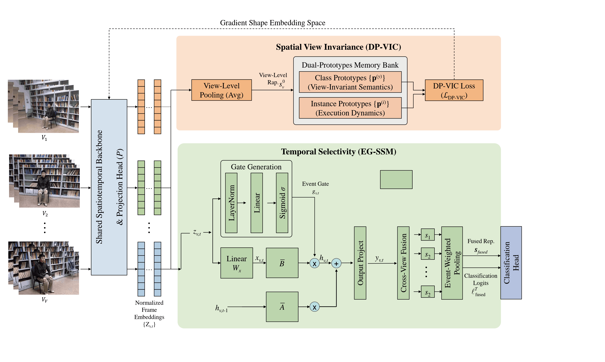
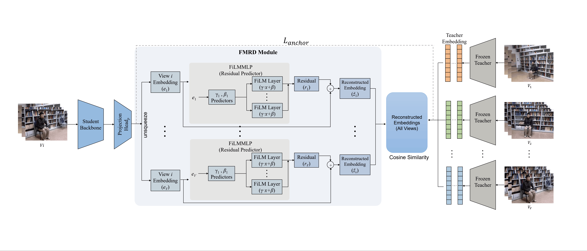

# KD-MVNet: Multi-View to Single-View Distillation via Hierarchical Prototypes and Cross-View Reconstruction

Implementation of KD-MVNet, a teacher–student framework for transferring multi-view robustness into a single-view action recognition model through hierarchical prototype learning and feature-space reconstruction distillation.


# Abstract
Multi-view action recognition improves robustness by observing actions from multiple synchronized cameras, but such setups are often infeasible at deployment. In contrast, single-view models entangle action semantics with viewpoint-dependent variations such as occlusion, foreshortening, and camera-relative motion, leading to a persistent performance gap.

To address this limitation, we propose KD-MVNet (Knowledge Distillation Multi-View Network), a framework that transfers view-invariant and temporally selective knowledge from multi-view training data into a compact single-view model. During training, the multi-view teacher network utilizes Dual-Prototype View-Invariant Contrastive Learning (DP-VIC) to separate category-level semantics from execution-specific dynamics. It also employs an Event-Gated State-Space Model (EG-SSM) with cross-view consistency to emphasize sparse, discriminative moments.

The single-view student then learns via Feature-Space Multi-View Reconstruction Distillation (FMRD). FMRD aligns the student’s embeddings to a multi-view consensus target and enforces the predictability of per-view teacher features from a single-view bottleneck, significantly improving generalization to unseen viewpoints.

Extensive experiments show that the single-view student achieves 92.7% on NTU RGB+D 60, 88.9% on NTU RGB+D 120, 97.0% on Northwestern-UCLA, and 94.3% on PKU-MMD, outperforming strong single-view baselines while closely approaching multi-view teacher performance.


# Architecture
## Multi-View Teacher Learning


- **Shared spatiotemporal backbone extracts frame-level features from synchronized views** 
- **DP-VIC enforces view-invariant semantics and execution-aware structure** 
- **EG-SSM performs event-gated temporal modeling** 
 
## Single-view student learning

- **The student receives only one camera stream** 
- **Anchor alignment pulls the student toward the teacher’s multi-view consensus** 
- **Cross-view reconstruction forces the student to preserve enough information to predict teacher embeddings from all synchronized views** 


# Datasets
We use four public datasets to evaluate our method.
- **NTU RGB+D 60** 
- **NTU RGB+D 120** 
- **Northwestern-UCLA** 
- **PKU-MMD** 

# Installation
### Requirements

```bash
pip install -r requirements.txt
```

# Citation

If you find this work useful, please cite:

```bibtex
@article{ma2026kdmvnet,
  title={Multi-View to Single-View Distillation via Hierarchical Prototypes and Cross-View Reconstruction},
  author={Ma, Le and Freitas dos Santos, Thiago and Magnenat-Thalmann, Nadia and Wac, Katarzyna},
  year={2026}
}
```
